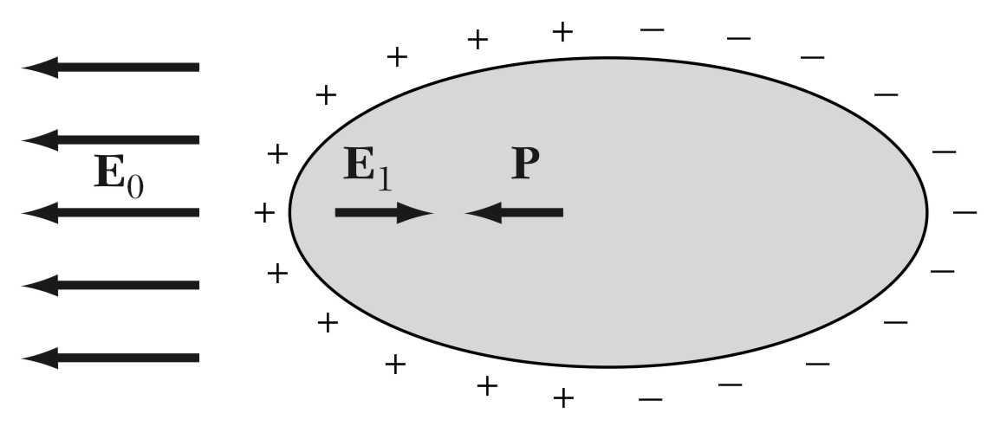

## Dielectric basics

### Macroscopic properties

- Electric field $E$
- Polarization $\vec P$
- Displacement $\vec D = \epsilon_0 \vec E + \vec P$

### Susceptibility and dielectric constants

- $\vec P = \epsilon_0 \chi_e \vec E$
- $\vec D = \epsilon_0 (1+\chi_e) \vec E = \epsilon_0\epsilon_r \vec E$
- Relative dielectric constant $\epsilon_r = \kappa = 1 + \chi_e$

## Dielectric and matter

Under an external electronic field, the redistribution of electrons in matter causes **depolarization** and also contributes to the electric field in space.

{style="max-width:300px"}

### Inside material

The depolarization field inside a material has the form $\vec E = -\frac{N}{\epsilon_0}\vec P$, in the case of a sphere, $N = 1/3$, which gives

$$
\vec E_\text{depol} = -\frac{1}{3\epsilon_0}\vec P
$$

### Outside of material

The external field is

$$
\vec{E}(\vec{r})=\frac{3(\vec{p} \cdot \vec{r}) \vec{r}-r^{2} \vec{p}}{4 \pi \epsilon_{0} r^{5}}
$$

### Clausius–Mossotti relation

We consider the field

$E = E_\text{sphere} + E_\text{cavity}$

Then

$E_\text{cavity} = E_\text{external} + 1/3\epsilon_0 \vec P$

$\vec P = N\alpha E = N\alpha(1+1/3\epsilon_0 \vec P)$

Polarizablity $\alpha$ is defined by $\vec P = N \alpha \vec E$, which gives

$$
\frac{\alpha}{4\pi\epsilon_0} = 3V \left(\frac{\kappa - 1}{\kappa + 1}\right)
$$

And actually 

Classical theory start from

$$
m\ddot x + m\omega_0x^2= eE = e E_0\cos\omega t
$$

treat it as a harmonic oscillator with a frequency $\omega_0$ under AC field $\alpha$ is a function of frequency $\omega$, see [[Resonators, general susceptibility, and AC effects]] for the classical theory

Where the polarizability can be obtained

$$
\alpha = p / E = ex / E
$$

And we found $x = e^2 / m(\omega_0^2 - \omega^2)$

In fact we can see [...]

{style="max-width:400px"}

## References

- Kittel, C., & McEuen, P. (2018). *Kittel's Introduction to Solid State Physics*. John Wiley & Sons.