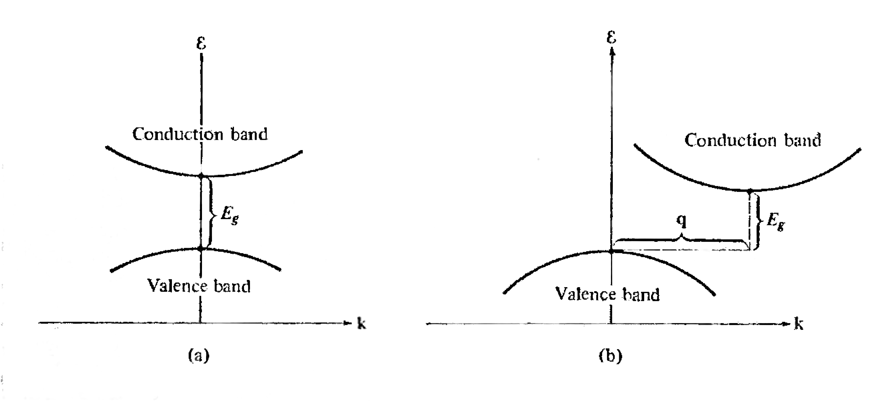

## Mobility

The carrier mobility is defined by

$$ \mu \equiv v_D / E $$

From [[Drude model for conductivity]], we have

$$ \sigma = J / E = \frac{nev_D}{E} = ne\mu $$

And $\mu = \sigma / ne = e\tau/m^*$

Here in semiconductors, the carrier density $n$ is tuned.

### Temperature effect

In metals, conductivity decreases with increasing temperature. This is generally caused by the reduced relaxation time $\tau$ because of the increasing lattice vibrations.

However, in semiconductors, the conductivity will be overwhelmed by the huge increase in carrier density (generally, $n(T) \approx N\exp(-E/KT)$).

## Density

Density of the occupying electrons $\rho$ is the density of states $D(E)$ times state occupancy $f(E)$.

$$ \rho(E) = \mathrm{d}n(E) / \mathrm{d}E = D(E)f(E) $$

## Direct and indirect bandgap

To direct bandgap semiconductor can emit photon directly, indirect semiconductors must have phonon involve.

## Number of holes/vacancies

$$ n = \int^\infty_{E_\text{g}} f(E) D(E) \mathrm{d}E \quad \text{and} \quad p = \int^{E_\text{g}}_0 [1-f(E)] D(E) \mathrm{d}E $$

with Fermi-Dirac distribution function $f(E) = 1 / (1 + \exp \frac{E - \mu}{kT})$ and $D(E) = D_e\sqrt{E - E_\text{g}}$ from **electron gas** model.

$$ n = \int^\infty_{E_\text{g}} f(E) D(E) \mathrm{d}E \quad \text{and} \quad p = \int^{E_\text{g}}_0 [1-f(E)] D(E) \mathrm{d}E $$

Where $N_\text{c}, N_\text{v} \propto (m_{\text{c,v}})^{3/2} T^{3/2}$

Then conveniently we have

$$ np = N_\text{c}N_\text{v}e^{-E_\text{g}/kT} $$

### Intrinsic case

$$ n = p = n_\text{i} $$

We have $n = p = \sqrt{N_\text{c}N_\text{v}}e^{-E_\text{g}/2kT}$

## Intrinsic and extrinsic semiconductor