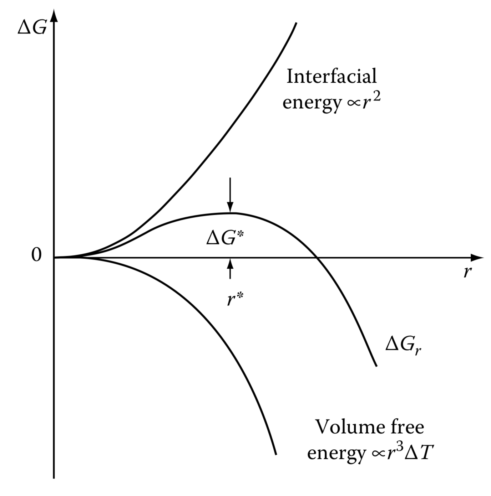

## Thermodynamics of nucleation

### Homogeneous nucleation

The formation energy $\Delta G_\text{f}$ of the spherical cluster has the expression in the form

$$
\Delta G_\text{f}(r) = \frac{3}{4}\pi r^3\Delta G_V + 4 \pi r^2\sigma
$$

Critical cluster with radius $r^*$ has $\left. \partial G_\text{f} / \partial r \right|_{r=r^*} = 0$, which gives

$$
r^* = -\frac{2\sigma}{\Delta G_V} \quad \text{and} \quad \Delta G_\text{f}(r^*) = \frac{16\pi}{3}\frac{\sigma^3}{\Delta G_V^2}
$$

### Heterogeneous nucleation

$$
\Delta G_\text{het} = \Delta G_\text{homo} S(\theta)
$$

## Kinetics

### The absorption formalism (gas)

$$
I = N^* A^* J^+
$$

### In condensed systems

In condensed systems, the number of critical clusters $N^*$, the number of atoms in touch with critical clusters $A^*$, and the jump frequency $\Gamma$ control the nucleation frequency.

$$
I = N^*\,A^*\,\Gamma
$$

- $N = N_0 \exp(-\Delta G^*/K_BT)$,  where $\Delta G \propto \Delta T^{-2}$
- $\Gamma = kT/\hbar \exp(Q/K_BT)$

### The “classical nucleation theory” (CNT) formalism

#### Cluster assumption

{.w-25}

For a cluster of size $n$ at time $t$, the nucleation rate $I_n$ is

$$
I_{n, t}=N_{n, t} k_{n}^{+}-N_{n+1, t} k_{n+1}^{-}
$$

And we have

$$
\frac{\partial N_{n,t}}{\partial t} = I_{n - 1,t} - I_{n,t} 
$$

These two equations together is called “master equation” for the system.

#### Cluster size

$$
N_\text{e} = N_0\exp(-\Delta G / k_BT)
$$

#### Nucleation rate

> ...nucleation rate at a cluster size $n$, $I_{n,t}$, is the time-dependent flux of clusters past that size.
> 

#### Equilibrium state assumption

In equilibrium state $I^\text{e}_n = 0$, therefore,

$$
N_{n}^{\mathrm{e}} k_{n}^{+}=N_{n+1}^{\mathrm{e}} k_{n+1}^{-}
$$

We can have a simplified expression for flux at steady state

$$
I^{\mathrm{s}}=N_{n}^{\mathrm{e}} k_{n}^{+}\left[\frac{N_{n}^{\mathrm{s}}}{N_{n}^{\mathrm{e}}}-\frac{N_{n+1}^{\mathrm{s}}}{N_{n+1}^{\mathrm{e}}}\right]
$$

#### Steady state nucleation rate

In a true steady state, $I^\text{s}$ is independent of size $n$, we therefore have

$$
\sum_n \frac{I^\text{s}_n}{K_n^+N_n^\text{e}} = I^\text{s}\sum_n \frac{1}{K_n^+N_n^\text{e}}  = 1
$$

If we assume that the cluster of the critical size $n^*$ dominant the effect, we can recover the Volmer-Weber equation $I^\text{s} = K_{n^*}^+N_{n^*}^\text{e}$.

Zeldovich factor $Z$

#### Continuum approximation: Zeldovich-Frenkel equation

The continuum approximation use $\partial I_{n,t} / \partial n = I_{n+1,t} - I_{n,t}$

A diffusion like expression

$$
\frac{\partial N_{n, t}}{\partial t}=\frac{\partial}{\partial n}\left[k_{n}^{+} N_{n}^{\mathrm{e}} \frac{\partial}{\partial n}\left(\frac{N_{n, t}}{N_{n}^{\mathrm{e}}}\right)\right]
$$

If we further include the cluster size approximation $N_\text{e} = N_0\exp(-\Delta G / k_BT)$, we can obtain “diffusion term” (driven by gradient in concentration) and “drift term” (driven by free energy as function of $n$).

$$
\frac{\partial N_{n, t}}{\partial t} = \frac{\partial}{\partial n}\left[k_n^+\left(\frac{\partial N_{n,t}}{\partial n} + N_{n, t}\frac{\partial \Delta G_n}{\partial n}\right)\right]
$$

## Temperature effect

The nucleation is controlled by both thermal (critical formation energy $\Delta G^*_\text{f}$) and kinetic term (jump frequency is controlled by $Q$).

