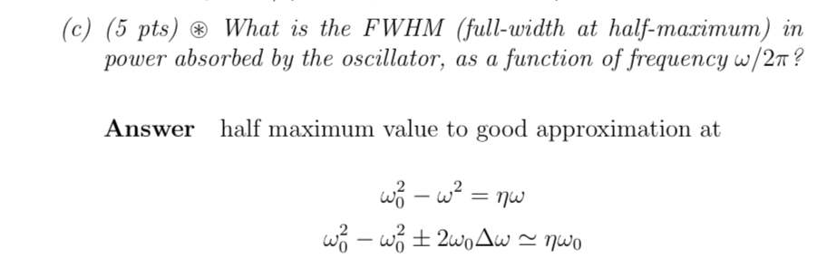

### Anelastic and viscoelastic

“Anelastic” or “viscoelastic” behavior is the delayed (out of phase) elastic response caused by additional (usually internal friction or energy dissipation) terms in the equations of motion.

For example, if we have $\sigma_i = 3\eta \dot\epsilon_i$, then because in half of a period, $\epsilon_i$ and $\dot\epsilon_i$ have opposing direction, $\sigma_i$ will dissipate energy.

### Composite solids

- Maxwell solids (isostress) $E^{-1} = E_A^{-1} V_A + E_B^{-1} V_B$
- Voigt solids (isostrain) $E = E_A V_A + E_B V_B$

### Quality factor, or Q-factor

Quality factor (or Q-factor) is $2\pi$ times the ratio of maximum energy stored ($U_\text{max}$) to the energy dissipated per cycle ($\Delta q$)

$$
Q = 2\pi\frac{U_\text{max}}{-\Delta q}
$$

- A more straightforward and more reasonable definition, I believe is
  
  $$ Q(\omega) = \omega \cdot \frac{\text{maximum energy stored}}{\text{power loss}} $$
    

For a spring with Young’s modulus $E = E' + iE''$, the quality factor is

$$
Q = -\frac{E'}{E''}
$$

Q-factor sometimes refer to $Q^{-1}$, it is equal to $\tan \delta$, the phase delay, which is $-E''/E'$, caused by “viscoelasticity”, the imaginary part $E''$.

$$
\tan\delta = Q^{-1} = -\frac{E''}{E'}
$$

The estimation of decay time based on quality factor is

$$
\tau_C = Q / \pi\nu
$$

see the piano wire example in Bailey’s lecture note.

### Q-factor in equation of motion

We can absorb the $Q$ term into the equation of motion.

Originally, the equation of motion is

$$
F/m = \omega_0^2x + \eta \dot x + \ddot x
$$

Assume $F/m = F_0\,e^{i \omega t}$ and $x = \tilde x_0 e^{i \omega t}$, we have

$$
F_0 / m = \omega_0^2 \tilde x_0 + i\eta\omega \tilde x_0 - \omega^2 \tilde x_0
$$

Because $E'' = E'Q^{-1}$, we have $i\eta\omega = iQ^{-1}\omega_0^2$ (or more commonly, $Q \approx \omega_0 / \eta \approx \omega_0/\Delta\omega$ ). If we assume $\Delta\omega = \omega - \omega_0$, we further find the FWHM of energy absorption

$$
2 \Delta \omega_{1 / 2}=\omega_{0} Q^{-1}
$$

- See example
  
    
    

### Q-factor for linear solid

$$
Q^{-1} = [Q^{-1}]_\text{max} \frac{2\omega\tau}{1+\omega^2\tau^2}
$$

### Snoek damping

Snoek shows that:

Vibrational frequency follows $\nu = \nu_0 \exp(-\frac{\Delta H}{kT})$. The quality factor can be adjusted by changing temperature, and doping.

90517-7)](Untitled%201.png)
