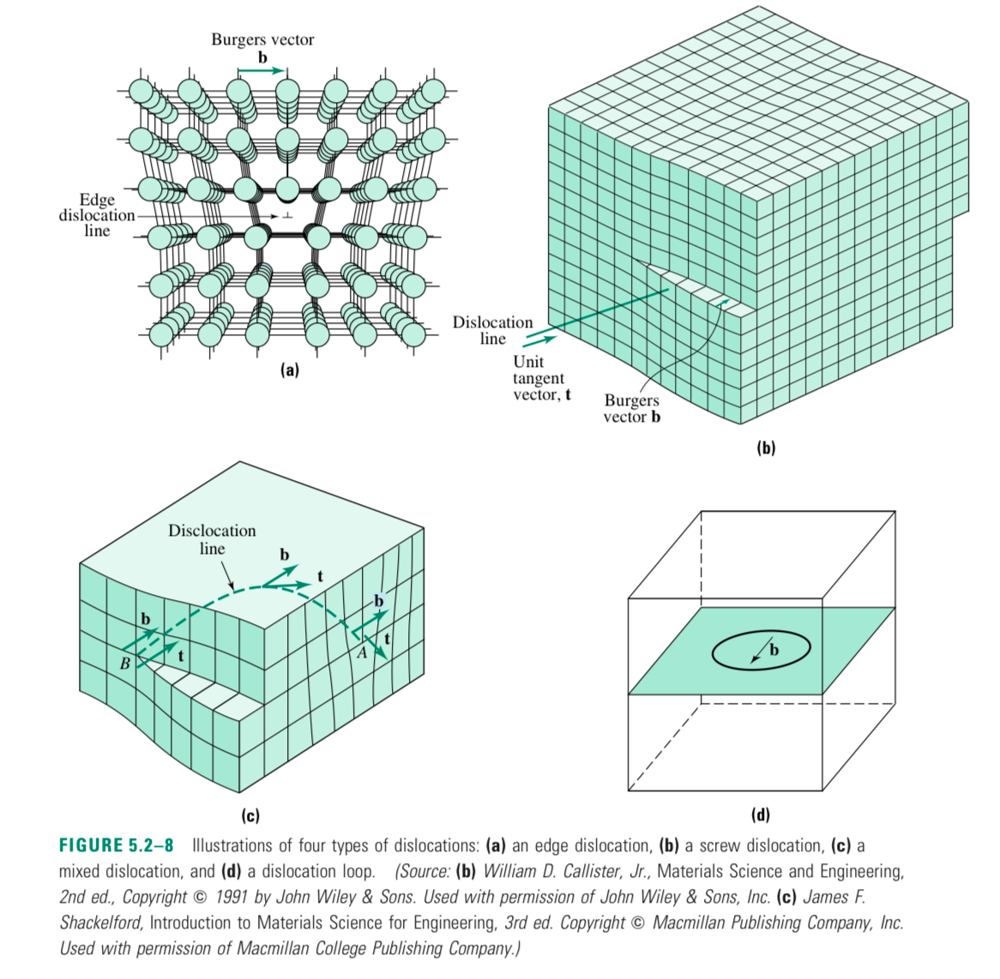
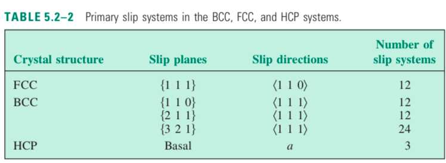
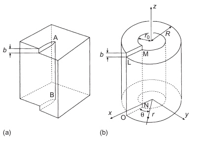

## Dislocation basics

### Burgers vector, tangent vector, and slip plane

- Burgers vector $\vec b$
  - The same dislocation shares the same $\vec b$
- Unit tangent vector $\vec t$
- Slip plane $\vec b \times \vec t$

#### Edge dislocation

- Edge dislocation $\vec b \perp \vec t$
- Edge dislocation symbol $\perp$
    - Vertical line: half plane, broken bonds
    - Horizontal line: slip plane

#### Screw dislocation

- Screw dislocation $\vec b \parallel \vec t$

### Slip system

Usually, the highest density plane.

## Force on dislocation: Peach-Koehler formula

The peach-Koehler formula gives us the force on a dislocation line $\vec f_\text{d}$ under a stress field $[\sigma]$.

$$
\frac{\vec f_\text{d}}{\delta l} = ([\sigma]\,\vec b) \times \hat l
$$

## Strain, stress, and self-energy of dislocation

With the Peach-Koehler formula, we are able to obtain the force on a dislocation line under a stress field. If we have the stress field of another dislocation, we can calculate the force “between” the two dislocations.

## Strain field, stress field of a dislocation

###  Results

|             | Screw dislocation                                            | Edge dislocation                                             |
| ----------- | ------------------------------------------------------------ | ------------------------------------------------------------ |
| Strain      | $\epsilon_{z\theta} = \frac{b}{4\pi}\left(\frac{1}{r}\right)$ |                                                              |
| Stress      | $\sigma_{z\theta} = \frac{Gb}{2\pi}\left(\frac{1}{r}\right)\sigma_{z\theta} = \frac{Gb}{2\pi}\left(\frac{1}{r}\right)\sigma_{z\theta} = \frac{Gb}{2\pi}\left(\frac{1}{r}\right)$ | $\sigma_{z\theta} = \frac{Gb}{2\pi(1-\nu)}\left(\frac{1}{r}\right)$ |
| Self energy | $\frac{Gb^2}{4\pi} \ln\frac{R_\text{max}}{R_\text{c}}$       | $\frac{Gb^2}{4\pi(1-\nu)} \ln\frac{R_\text{max}}{R_\text{c}}$ |

Important points:

1. Stiffer materials have higher dislocation energy, $U_e \propto G$.
2. Comparatively, edge dislocation will have higher energy because of the $\frac{1}{1-\nu}$ term.
3. Strain falls off as $1/r$.

## See also

- [[Point defects (0D defects)]], which has more of a thermodynamic aspect.
- *Science and Design of Engineering Materials* has a really good chapter on this topic.
