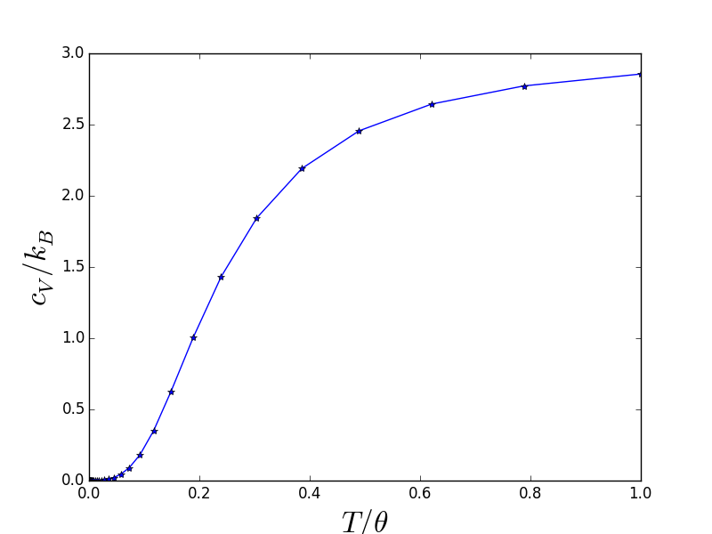
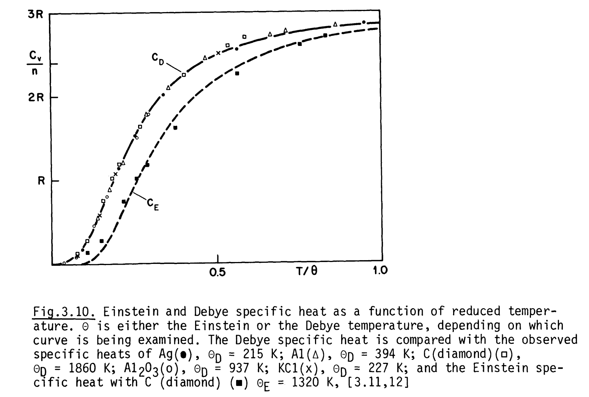
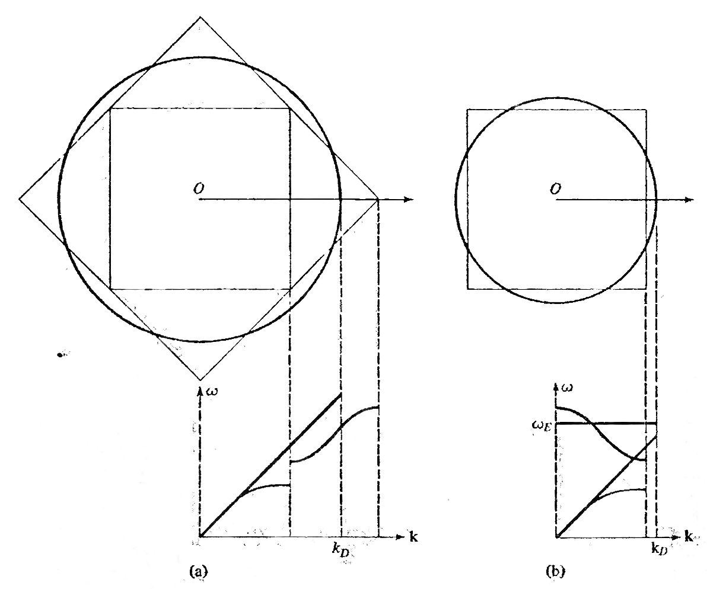
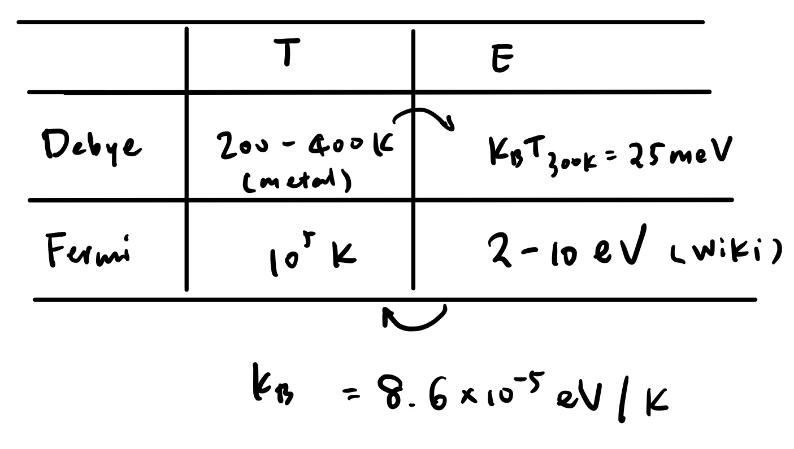

## Specific heat for classical harmonic oscillator and Dulong–Petit law

For classical 1D harmonic oscillators, according to the [equipartition theorem](https://www.notion.so/Equipartition-theorem-82bb06525ef84a7c94a2e048af424f25), the partition function $Z$ is given by

$$ Z = \iint e^{-\beta H(x,p)} \mathrm{d}x \mathrm{d}p = (\beta\hbar\omega)^{-1} = \frac{k_\mathrm{B}T}{\hbar\omega} $$

Energy $E$ can be obtained from $Z$, by $E = -\partial Z / \partial \beta = k_\mathrm{B}T$, so $C_V = \partial E / \partial T = k_\mathrm{B}$.

From harmonic/quasiharmonic approximation, we can arrive at similar results.

For a 3D system with $N$ atoms, it would be $C_V = 3NK_B$, known as Dulong–Petit law. The constant specific heat is contradictory to experimental measurement vs. $T$. So we have the proceeding discussion about the lattice specific heat with the Debye and the Einstein model.

Also, monoatomic gas: $3/2R$

## Debye model

### Basic assumptions in the Debye model

Basically, we assume linear dependence in $\omega$ vs. $k$ for acoustic modes $\omega = kv_m$ (which is true for acoustic modes near $\Gamma$ point), then the energy of mode $E = \hbar \omega = \hbar v_m k$.

The density of state in $k$ space, in comparison with [[free-electron-gas|Free electron-gas model]], we have 3 modes (1 LA + 2 TA, or longitudinal and transverse acoustic modes).

$$ D_{k^3} = \frac{3}{(\pi / L)^3} $$

Total number of states in $k$ space is 3N, gives the cut-off $k_\text{D}$,

$$ Q(k_\mathrm{D}) = D_{k_\mathrm{D}^3} \frac{1}{8} \frac{4}{3}\pi k_\mathrm{D}^3 = 3N $$

This gives rise to the integration $E = \int_0^{k\theta_\mathrm{D}} g(\epsilon)\,\epsilon\,\mathrm{d}\epsilon$.

### High-$T$ and low-$T$ limits

- Replace all phonon modes with three branches $\omega = ck$
- At low-T ($T \ll \theta_D$), $c_V \propto T^3$
- At high-T ($T \gg \theta_D$), $c_V = 3Nk_\text{B}$
- $c_V$: heat capacity per atom, $c_V = C_V / N$

## Einstein model

- Assume that $\omega \propto k$ for acoustic mode, $\omega = \omega_\text{E}$ (constant) for optical mode

### Limits

- At low-T ($T \ll \theta_E$), $c_V \propto T^{-2}\exp(1/T)$
- At high-T ($T \gg \theta_E$), $c_V = 3Nk_\text{B}$ (Dulong–Petit law)

Comparison between Einstein and Debye lattice specific heat. (via Bailey course note)

The approximation in phonon modes adopted by (a) Debye model (b) Einstein model to calculate lattice specific heat. (via Ashcroft & Mermin)

### Assumption and derivation of Einstein solid from microcanonical (*NVE*) ensemble

For a solid with $N$ atoms, assume $q$ quanta, total $3N$ simple oscillator, with state $\hbar\omega$ each.

Further assume that $E_0 = 3N\hbar\omega$, $E = q\hbar\omega$ (sometimes, we would want to include the ground state term, then $E = (q+N/2)\hbar\omega$, see [Wikipedia](https://en.wikipedia.org/wiki/Einstein_solid), and the plot above, this does not impact the final result).

Entropy

$$ S = k\ln \Omega = k\ln\frac{(3N-1+q)!}{(3N-1)!\,q!} $$

After Sterling’s approximation, we will have

$$ S = 3R\left[\left(1 + \frac{E}{E_0}\right)\ln\left(1 + \frac{E}{E_0}\right) - \frac{E}{E_0} \ln \frac{E}{E_0}\right] $$

This is  $S(E)$, from here we get perform the thermodynamics ($1/T =\partial S / \partial E$, then $C_V = \partial E/\partial T$).

The final result for specific heat is

$$ C_{V}=3 N k\left(\frac{\varepsilon}{k T}\right)^{2} \frac{e^{\varepsilon / k T}}{\left(e^{\varepsilon / k T}-1\right)^{2}} $$

## Electronic specific heat

Electronic specific heat is about $10^{-2}$ compared to classic specific heat ($\frac{2}{3}k_\text{B}$) at room temperature (according to Wikipedia).

$$ c_V =   \frac{\pi^2}{2} k_\text{B}^2 T / E_\text{f} = \frac{\pi^2}{2} k_\text{B}^2 (T / T_\text{f}) $$

Under the Drude model, the electronic specific heat $c_V \propto T$.

See also [[Drude model for conductivity]], [[Free electron-gas model]].

### Comparing electronic and lattice specific heat

Clearly, $T_\text{f} \gg T_\text{D}$. But electronic is $\propto T$, lattice $\propto T^3$. At room temperature, lattice specific heat is usually more obvious than electronic specific heat, but low-temperature specific heat is dominated by electronic contribution in metals.

](p5.png)

## References

- Ashcroft, N. W. & Mermin, N. D. *Solid state physics*. (Holt, Rinehart and Winston, 1976).
