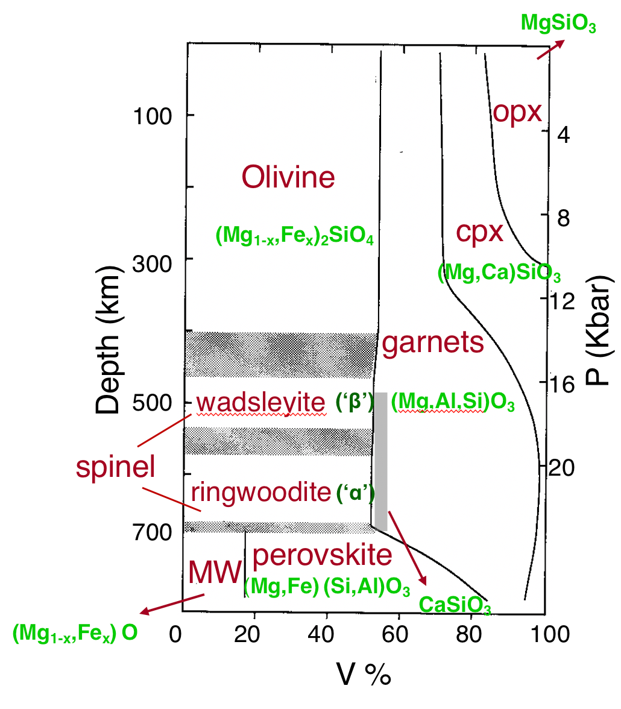
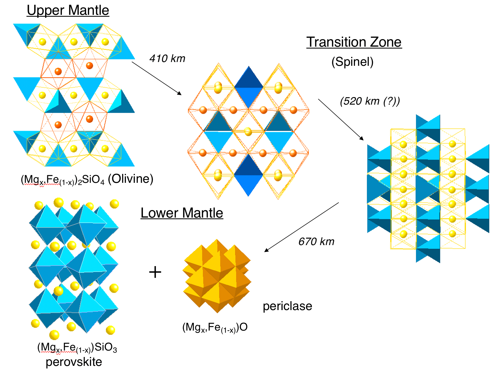
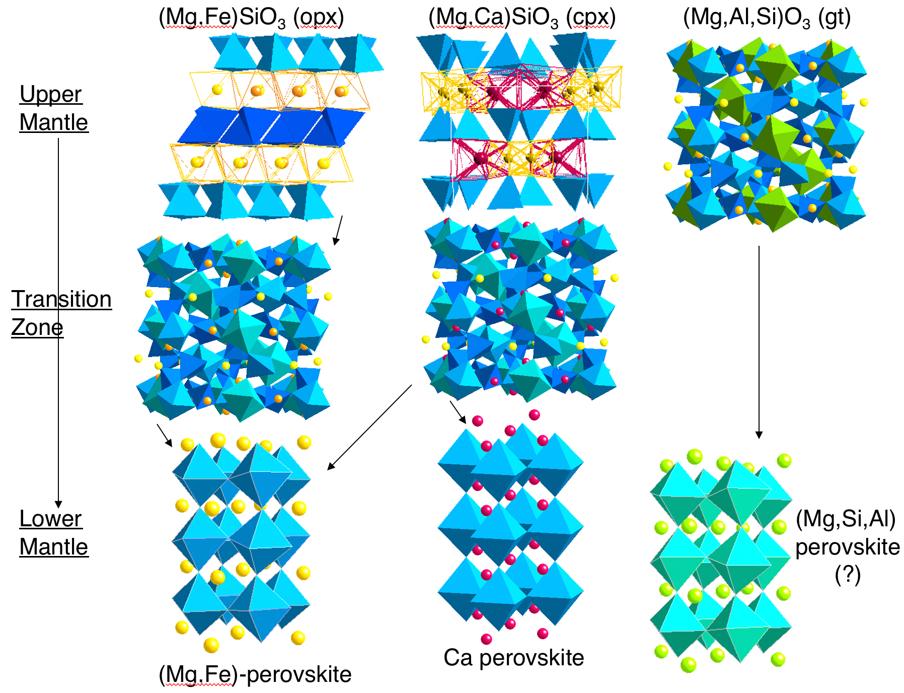

The mineral composition can be calculated based on the chemical (elementary) composition of the mantle.

- Upper mantle
  - Olivine ($\ce{\alpha-(Mg,Fe)2SiO4}$)
  - Garnet
  - Pyroxene ($\ce{MSiO3}$ system)
    - Orthopyroxene
    - Clinopyroxene
- Transition zone
  - Spinel ($\ce{M2SiO4}$ system)
    - Wadsleyite ($\ce{\beta-(Mg,Fe)2SiO4}$)
    - Ringwoodite ($\ce{\alpha-Mg2SiO4}$)
- Lower mantle
  - Periclase
    - Wüstite ($\ce{(Mg,Fe)O}$)
  - Perovskite
    - Bridgmanite (magnesium end-member ($\ce{(Mg,Fe)SiO3}$)
    - CaPv ($\ce{CaSiO3}$)
  - Post-perovskite ($\ce{MgSiO3}$)

## References

- Wentzcovitch, R. M., Yu, Y. G., & Wu, Z. (2010). Thermodynamic Properties and Phase Relations in Mantle Minerals Investigated by First Principles Quasiharmonic Theory. *Reviews in Mineralogy and Geochemistry*, *71*(1), 59–98. https://doi.org/10.2138/rmg.2010.71.4