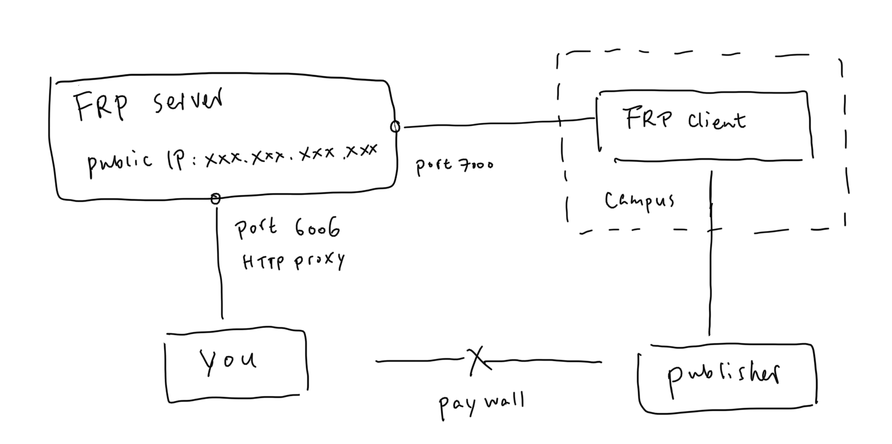

Since the pandemic, remote working has become *a thing*. Working on a HPC wasn't any more challenging because there is no difference wherever you access it from. However, accessing the research papers have been a little itchy: Columbia library provides a [bookmarklet](https://library.columbia.edu/services/tools/proxy-bookmarklet.html) to access the online resources via its ezproxy, but you have to login in every day, this becomes particular annoying when two-step verification is involved.

Besides using the proxy provided by the university, you can always use your own computer as a proxy: given you have a computer to spare, and a desk you can left it on. Since I already have a VPS which have a stable public IP address, I can use FRP-based solution without having to know the IP address of the computer I left in my office. Here is how I set up a basic HTTP proxy to access the library resources from home.

## FRP setup

[FRP](https://github.com/fatedier/frp) is a open-source proxy that allows you to expose a server behind firewall without having to know its specific address. Therefore, you will only need to know the IP address of your server, without having to checking IP address of the computer behind the university's firewall. It is convenient for our purpose, because it also comes with a [build-in plugin](https://github.com/fatedier/frp/blob/ddc1e163c4cbc87cc1eb0d3e936c91ec6080a89d/conf/frpc_full.ini#L233) that provides HTTP proxy capability.

FRP can be downloaded from its [release page](https://github.com/fatedier/frp/releases) on GitHub.

The following schematic diagram shows how the proxy is setup via FRP.



### FRP server configuration

FRP server is a computer that has public IP address (e.g., `xxx.xxx.xxx.xxx` here). I use a cheap VPS from [Vultr](https://www.vultr.com/?ref=9056315-8H) for this purpose. 

Prepare the following server configuration file and save as `frps.ini`.

```ini
[common]
bind_port = 7000
token = xxx-xxx
```

Start the server by

```bash
./frps -c frps.ini
```

### FRP client configuration

FRP client is a computer inside the campus. I use an old laptop computer and keep it running in my office.

Prepare the following client configuration file and save as `frpc.ini`.

```ini
[common]
server_addr = xxx.xxx.xxx.xxx
server_port = 7000
token = xxx-xxx

[plugin_http_proxy]
type = tcp
remote_port = 6006
plugin = http_proxy
plugin_http_user = xxxx
plugin_http_passwd = xxx-xxxxx
```

Start the client by

```bash
./frpc -c frpc.ini
```

### Accessing the proxy

Your local computer can now access the HTTP proxy with the following configuration:

- Protocol: HTTP
- Host: `xxx.xxx.xxx.xxx:6006`
- Username: `xxxx`
- Password: `xxx-xxxxx`

Although you can set it up as a system proxy, you might not want to proxy every website through it. To proxy only the specific publisher websites, I recommend [Proxy SwitchyOmega](https://chrome.google.com/webstore/detail/proxy-switchyomega/padekgcemlokbadohgkifijomclgjgif) as a browser plugin, [Surge](https://nssurge.com/) as a macOS/iOS/iPadOS app, or any proxy client you like.

## Alternatives

Right now, I am leaning more towards [Tailscale](https://tailscale.com/)’s "[Exit Nodes](https://tailscale.com/kb/1103/exit-nodes/)" functionality. It route all the traffic through on Tailscale's VPN network towards your exit node. There is nothing to lose if you are relying on that service already. It has more reliability, but less flexiblity (no per-website settings).