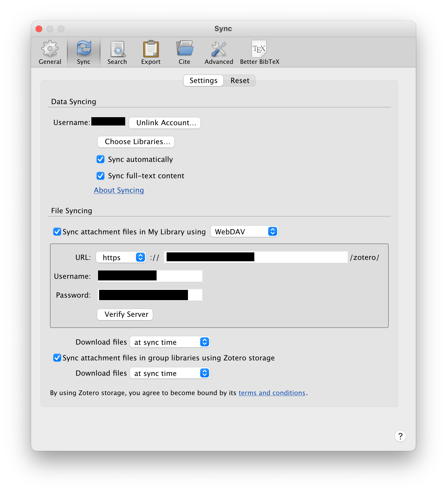
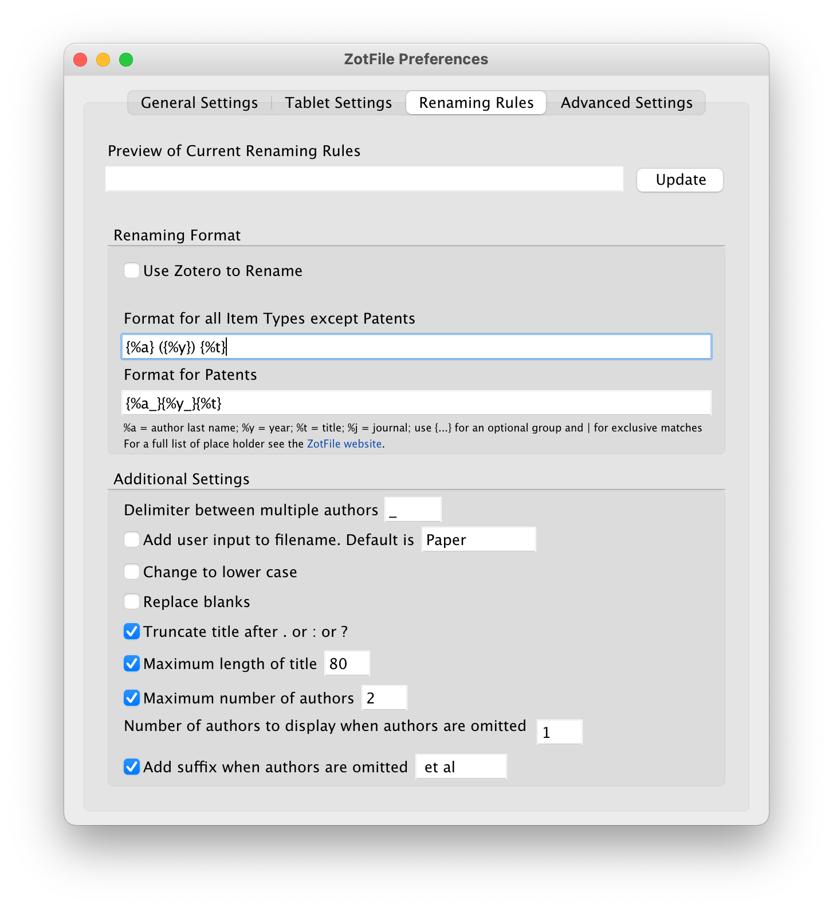

For anyone who reads and write research paper, a reference management software is a must nowadays. [Zotero](https://www.zotero.org) is a free and open-source reference management software, and it is the program of my choice.

Compared with some web-based solutions (e.g., [ReadCube](https://www.readcube.com/home)), with Zotero, I have the freedom direct access to the PDF attachement files, which, for-example, allows me to run my [Python script](https://github.com/chazeon/PDF-Watermark-Remover) to remove the watermarks freely. Its open extension system also have also inspired a lot of good contributions from the research community.

Here is how I setup my Zotero:

1. **Login with Zotero account and setup self-hosted WebDAV storage.**
   
    My WebDAV server is hosted on a VPS with [Caddy](https://caddyserver.com) as the HTTP server, which has a WebDAV server built-in.
    
    
    
2. **[ZotFile](http://zotfile.com/index.html#changelog) to manage attachment file naming.**

    My renaming rules set to `{%a} ({%y}) {%t}`.
    
    
    
3. **[BetterBibTeX](https://github.com/retorquere/zotero-better-bibtex) to make exported entry names more readable.**