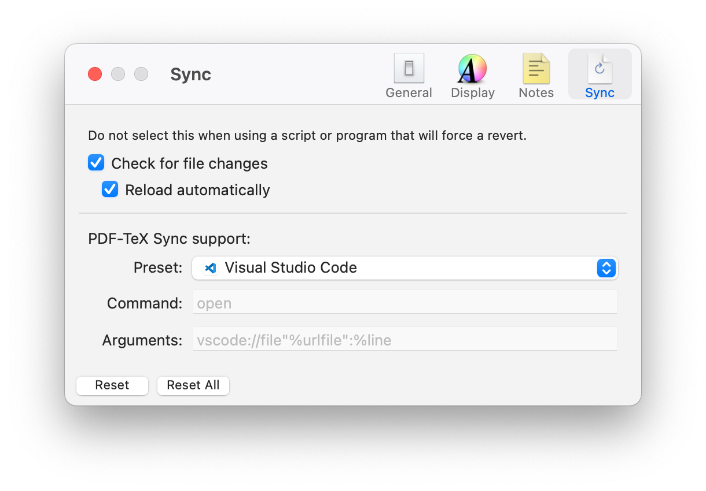

Nowadays, I would just use OverLeaf to compile LaTeX given its carefree LaTeX building environment. One of the most lovable feature is its arXiv export functionality. But when I am on-the-go, I would just fallback to build LaTeX locally to avoid a large phone bill caused by transfering of PDF preview image.

## VSCode $\LaTeX$-specific settings

Writing LaTeX, there is some specific tuning I prefer:

- Switch to a light theme to match the light background in the PDF document to reduce eye strain, here I use the [official GitHub Light theme](https://marketplace.visualstudio.com/items?itemName=GitHub.github-vscode-theme).
- Disable the minimap to reduce the spacing between the source code and PDF document.
- Increase the font size.

This tuning results in the following VSCode `.vscode/settings.json` file.

```json
{
    "latex-workshop.latex.autoBuild.run": "never",
    "workbench.colorTheme": "GitHub Light Default",
    "editor.minimap.enabled": false,
    "editor.fontSize": 13
}
```

In addition, I don't like LaTeX workshop's autobuild, so I set `latex-workshop.latex.autoBuild.run` to `never` and created my own build task:

```json
{
    "version": "2.0.0",
    "tasks": [
        {
            "label": "latexmk build",
            "type": "process",
            "command": "latexmk main.tex -pdf -pdflatex='pdflatex -synctex=1 -interaction=nonstopmode'",
            "problemMatcher": [],
            "group": {
                "kind": "build",
                "isDefault": true
            }
        }
    ]
}
```

## PDF Viewer with SyncTeX support

### Skim on macOS

On macOS, the best solution for preview the PDF is with [Skim](https://skim-app.sourceforge.io/), which supports SyncTeX.
Navigate back to VSCode with the shortcut `cmd+shift+click`.



### Samatra on Windows

I use [Sumatra PDF](https://www.sumatrapdfreader.org/free-pdf-reader) on Windows. It is based on the MuPDF backend and comes with SyncTeX support.


## References

- [LaTeX Workshop - Visual Studio Marketplace](https://marketplace.visualstudio.com/items?itemName=James-Yu.latex-workshop)
- [Skim Help: PDF-TeX synchronization (sourceforge.io)](https://skim-app.sourceforge.io/manual/SkimHelp_49.html)

