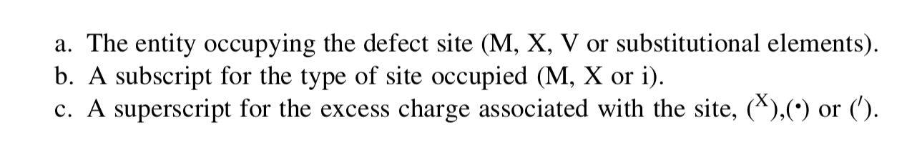

## Point defect basics

### Kröger-Vink notation

### Frenkel and Schottky defects

Frenkel and Schottky defects maintain charge neutrality; these defects are “intrinsic defects.” Examples of “extrinsic defects” include impurities.

#### Frenkel defects

$$
\ce{M^x_M -> M_i + V_M}
$$

#### Schottky defects

$$
\ce{null -> V^{''}_M + V^{..}_X}
$$

## Thermodynamics of defects

### Types of defects in different crystals

- For elementary crystals (such as metal), usually vacancy and interstitial defects are discussed.
- For compound crystals (such as ionic crystals), usually Frenkel and Schottky defects are discussed.

### Derivation of the expression for defect concentration

The expression for defect concentration is obtained from the equilibrium constant $K$:

- Determine $K$.
- $K = \exp\left(-\dfrac{\Delta G}{k_B T}\right)$.

### Defect concentration for different types of defects

#### Elementary crystals

- Vacancy (dominant): $X_{\mathrm{v}}=e^{\bar S_\mathrm{v}^{\mathrm{xs}} / k} e^{-\bar{H}_\mathrm{v} / k T}$
- Interstitial: $X_{\mathrm{D}}=f_{\mathrm{D}}\,e^{\bar S^{\mathrm{xs}} / k} e^{-\bar{H}_{\mathrm{D}} / k T}$, where $f_D$ is the ratio of interstitial sites to normal sites for a crystal.
- Divacancy: $X_{\mathrm{vv}}=\left(X_{\mathrm{v}}\right)^{2} \mathrm{e}^{\Delta \bar{S}_\text{int} / k} \mathrm{e}^{-\left(\Delta \bar{H}_\text {int} / k T\right)}$, accounting for two vacancies and their interaction energy.

#### Ionic crystals

- Frenkel: $X_{\mathrm{fd}}=\mathrm{e}^{\Delta S_{\mathrm{fd}}^{\circ} / 2 k} \mathrm{e}^{-\left(\Delta H_{\mathrm{fd}}^{\circ} / 2 k T\right)}$
- Schottky: $X_{\mathrm{sd}}=\mathrm{e}^{\Delta S_{\mathrm{sd}}^{\circ \mathrm{xs}} / 2 k} \mathrm{e}^{-\left(\Delta H_{\mathrm{sd}}^{\circ} / 2 k T\right)}$

## Defects and diffusion

See [[Diffusion]]

## See also

- [[Dislocations (1D defects)]], which has more of a mechanical aspect.
