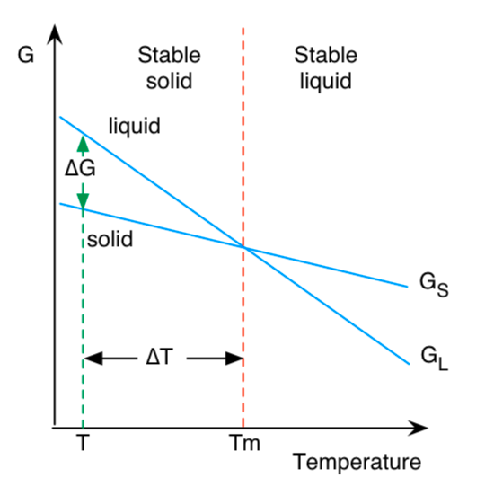
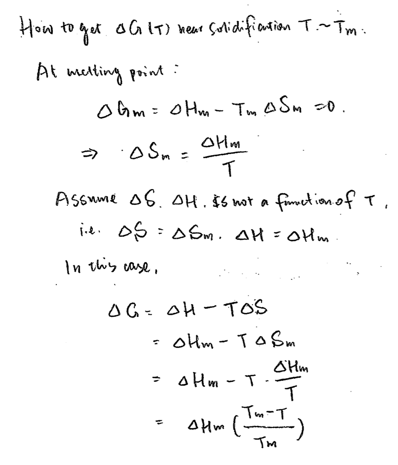

## Driving force

{.float-right style="width: 240px"} 

{style="width: 400px"}

## References

- [CFD-DivingForceForSolidification.pdf](CFD-DivingForceForSolidification.pdf)

- Porter, D. A., & Easterling, K. E. (2009). *Phase transformations in metals and alloys (revised reprint)*. CRC press.