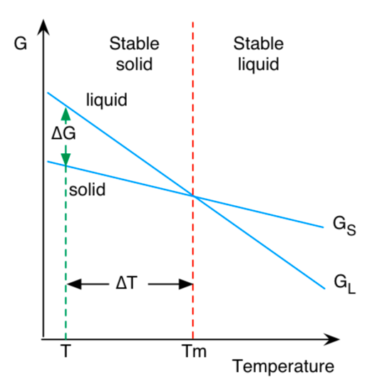

## Driving force

{.float-right style="max-width: 240px"} 

Near the melting temperature $T_m$, assume that the enthalpy and entropy changes are approximately independent of temperature:

$$
\Delta H \approx \Delta H_m
\quad \text{and} \quad
\Delta S \approx \Delta S_m.
$$

At the melting point, the solid and liquid are in equilibrium, so

$$
\Delta G_m = \Delta H_m - T_m \Delta S_m = 0,
$$

which gives

$$
\Delta S_m = \frac{\Delta H_m}{T_m}.
$$

Therefore, at a temperature $T$ near $T_m$,

$$
\begin{aligned}
\Delta G(T)
&= \Delta H - T\Delta S \\
&\approx \Delta H_m - T\Delta S_m \\
&= \Delta H_m - T\frac{\Delta H_m}{T_m} \\
&= \Delta H_m\left(\frac{T_m-T}{T_m}\right) \\
&= \Delta H_m\frac{\Delta T}{T_m},
\end{aligned}
$$

where $\Delta T = T_m-T$ is the undercooling.

## References

- [CFD-DivingForceForSolidification.pdf](CFD-DivingForceForSolidification.pdf)

- Porter, D. A., & Easterling, K. E. (2009). *Phase transformations in metals and alloys (revised reprint)*. CRC press.
