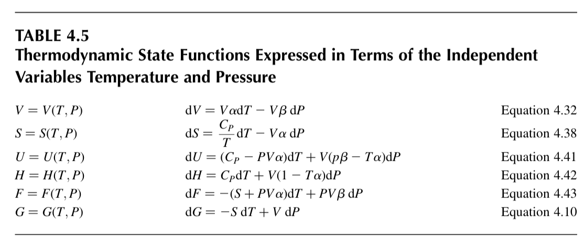

## Most important functions

- Thermodynamic potentials: $(U, H, F, G)$
- First derivatives: $(P, V, T, S)$
- Second derivatives: $(C_P, C_V, \alpha, \beta)$

## Important relationships

### Legendre transformation

Legendre transformation helps us to change the natural variable for a function.

For $Y(X)$, given $P = \mathrm{d}Y / \mathrm{d}X$, we have  $\Psi(P) = Y - PX$.

### Maxwell relations

For a good function exchange in the order of derivative does not matter. Its general form, according to [Wikipedia](https://en.wikipedia.org/wiki/Maxwell_relations), is called *Schwarz's theorem*:

$$
\frac{\partial }{\partial x_j}\left(\frac{\partial \Phi}{\partial x_i}\right)=
\frac{\partial }{\partial x_i}\left(\frac{\partial \Phi}{\partial x_j}\right)
$$

In thermodynamics, ...

## Other methods

### Everything as a function of $(T,P)$

## References

- [Maxwell relations - Wikipedia](https://en.wikipedia.org/wiki/Maxwell_relations)